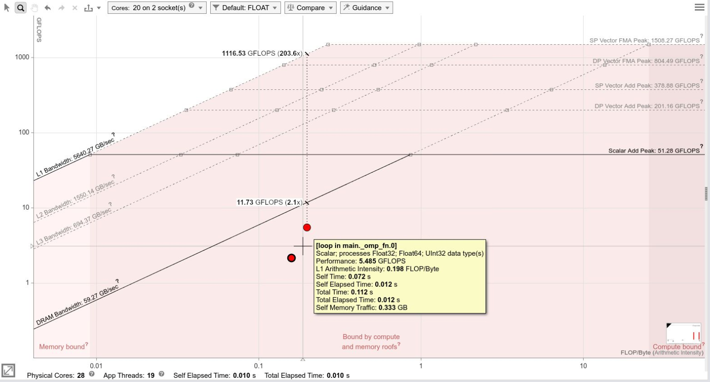
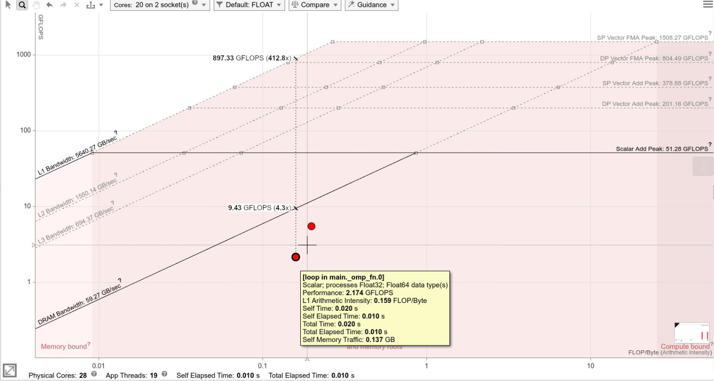
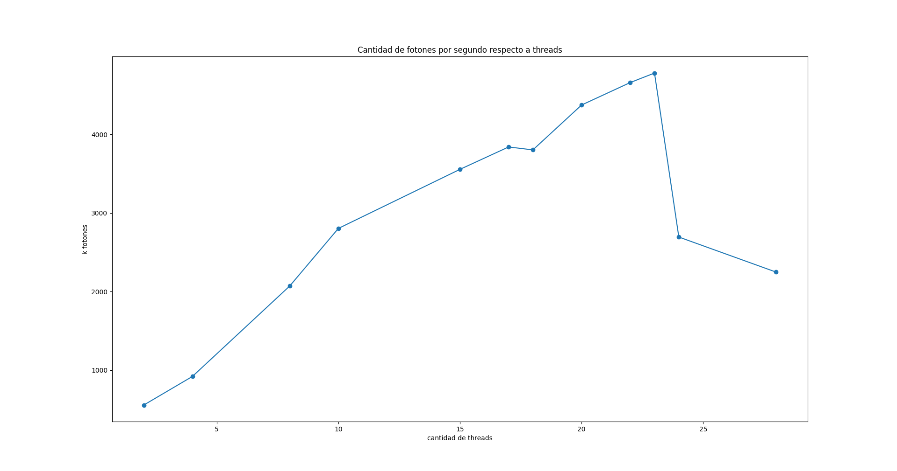

# Lab 3

### Escalera Pedro, Iman Federio.

En este lab hicimos uso de la herramienta Openmp que nos permitira ejecutar nuetro programa en varios hilos a la vez, aumentando asi la cantidad de fotones por segundo y obteniendo un mejor rendimiento.

### Mejoras respecto al lab anterior.
En el lab anterior nos vimos perjudicados por el hecho de que nuestro generador elegido, el mersenne twister, no funcionaba para vectorizar el codigo, por lo que usamos el generador de la libreria de C.
En este laboratorio decidimos cambiar y optamos por una implementacion de un generador congruente permutado que mejoro notablemente el rendimiento de nuestro programa.

### Open mp

En este lab usamos open mp de la siguiente manera:

    #pragma omp parallel for
    for (unsigned int i = 0; i < PHOTONS ; ++i) {
        photon(rng1);
    }

y luego con el comando 

    export OMP_NUM_THREADS=

elegiamos la cantidad de threads que queriamos lanzar.

### Optimizaciones
Para este Lab usando open mp, ademas de cambiar el generador de numeros aleatorios, optamos por no usar la funcion for reduction() ya que los resultados obtenidos, si bien eran mejores, no eran tan buenos como esperabamos. por esta razon decidimos hacer una version personalizada de la misma.

Para evitar race conditions realizamos los siguintes cambios al codigo.
Primero creamos el siguiente struct:

    typedef struct PhotonHeat {
        float *heat;
        float *heat2;
    }PhotonHeat;

y le asignamos a cada hilo un PhotonHeat distinto 

    #pragma omp parallel for schedule(dynamic)
    for (unsigned int i = 0; i < PHOTONS ; ++i) {
        photon(rngs[omp_get_thread_num()], partials[omp_get_thread_num()]);
    }

Para finalmente reconciliar cada PhotonHeat en uno y asi evitar race conditions.

    #pragma omp parallel for schedule(dynamic)
    for (unsigned int i = 0; i < SHELLS ; i++){
        for(int j = 0; j < num_threads; j++){
            heat[i] += partials[j].heat[i];
            heat2[i] += partials[j].heat2[i];
        }
    }
Para la union tambien aprovechamos openmp y la realizamos en paralelo.

Otras mejoras. 
a cada thread le pasamos su propio generador con una semilla unica 

 pcg32_srandom_r(&(rngs[i]), time(NULL) * (i + 1), (intptr_t)&(rngs[i]));

donde i es el numero de thread en el que esta corriendo.

y para medir el tiempo usamos la funcion 

    omp_get_wtime();

ya que vimos que era lo optimo en cuanto a paralelismo.

### Resultados 

#### Roofline

Resultados obtenidos con roofline.

### Graficos
Para este lab usamos la computadora zx81, una computadora con el Intel® Core™ i7-8550U CPU @ 1.80GHz × 8 y otra con un Apple M1 x 8
Primero nos parecio interesante ver los resultados obtenidos comparando los mejores resultados de varias corridas para nuestras computadoras tanto para 2,4 y 8 hilos.
Obteniendo asi los siguientes resultados.

En este grafico es interesante notar que 
- El aumento de velocidad no es lineal
- El aumento de velocidad parea el procesador i7 es realmente grandioso respecto a los resultados obtenidos en el lab 2, lo que prueba que fuimos realmente perjudicados por el generador rand()

Ahora nos parecio interesante comparar los resultados del procesador i7 en el lab 1,2 y 3.

Aqui vemos la mejora respecto a labs anteriores, esto se da por el uso de Open mp y el cambio de generador de numeros aleatorios.

En este grafico vemos como aumenta la cantidad de fotones por segundo respecto a la cantidad de threads utilizados, obteniendo como pico de mejor resultado 4782.568k fotones por segundo utilizando 23 threads.

### Posibles mejoras
como posible mejora, es usar open mp en nuestro codigo vectorizado del lab 2 pero adaptando la vectorizacion con un buen generador de numeros aleatorios.

### Conclusiones
Como conclusion podemos decir que obtuvimos un resultado increiblemente alto con el agreagado de unas pocas lineas usando open mp (sin contar que no usamos reduction) lo que nos llevo a procesar mas de 4000 fotones por segundo. cuando nuestro record de fotones por segundo fue de poco mas de 200 en zx81
