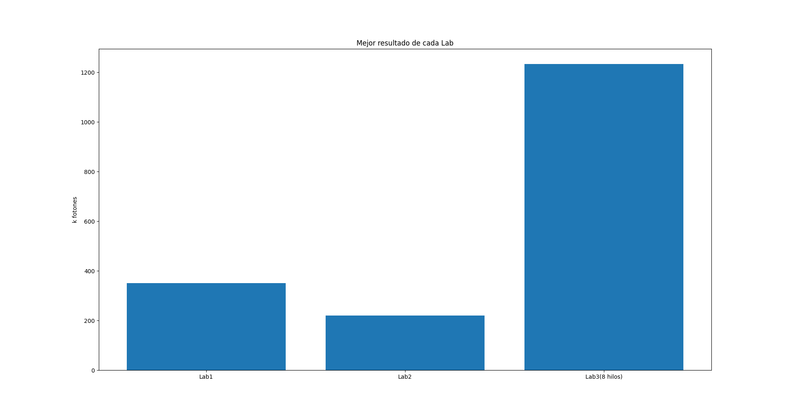

# Lab 3

### Escalera Pedro, Iman Federio.

En este lab hicimos uso de la herramienta Openmp que nos permitira ejecutar nuetro programa en varios hilos a la vez, aumentando asi la cantidad de fotones por segundo y obteniendo un mejor rendimiento.

### Mejoras respecto al lab anterior.
En el lab anterior nos vimos perjudicados por el hecho de que nuestro generador elegido, el mersenne twister, no funcionaba para vectorizar el codigo, por lo que usamos el generador de la libreria de C.
En este laboratorio decidimos cambiar y optamos por una implementacion de un generador congruente permutado que mejoro notablemente el rendimiento de nuestro programa.

### Open mp

En este lab usamos open mp de la siguiente manera:

    #pragma omp parallel for
    for (unsigned int i = 0; i < PHOTONS ; ++i) {
        photon(rng1);
    }

y luego con el comando 

    export OMP_NUM_THREADS=

elegiamos la cantidad de threads que queriamos lanzar.

### Resultados 
Para este lab usamos la computadora zx81, una computadora con el Intel® Core™ i7-8550U CPU @ 1.80GHz × 8 y otra con un Apple M1 x 8
Primero nos parecio interesante ver los resultados obtenidos comparando los mejores resultados de varias corridas para nuestras computadoras tanto para 4 hilos como para 8. obteniendo asi los siguientes resultados.

En este grafico es interesante notar que 
- El aumento de velocidad no es lineal
- El aumento de velocidad parea el procesador i7 es realmente grandioso respecto a los resultados obtenidos en el lab 2, lo que prueba que fuimos realmente perjudicados por el generador rand()
- En el caso del Apple M1 se pierde velocidad con 8 hilos (creemos que se da por el uso de los cores de baja potencia lo que produce un efecto contraproducente)

Ahora nos parecio interesante comparar los resultados del procesador i7 en el lab 1,2 y 3.

Aqui vemos como la mejora respecto a labs anteriores, esto se da por el uso de Openmp y el cambio de generador de numeros aleatorios.