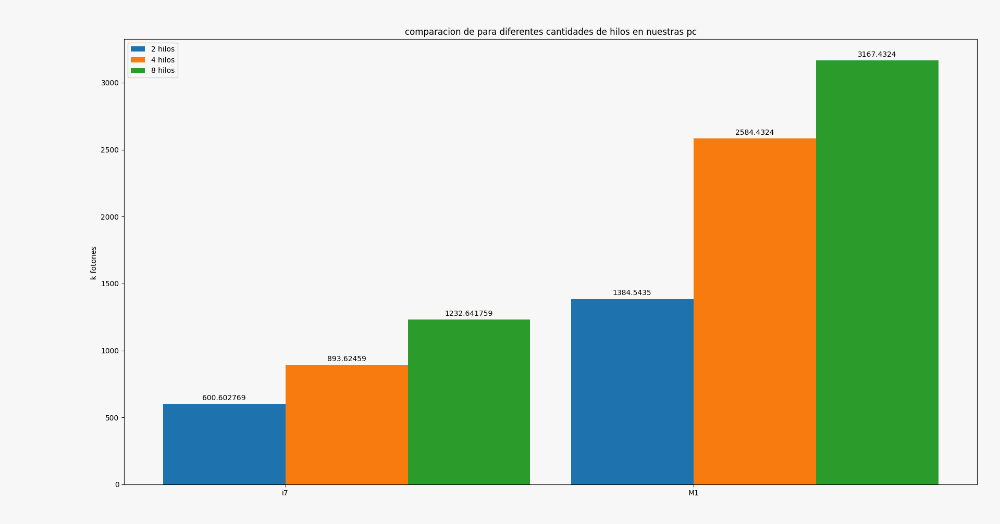

# Lab 3

  

## Escalera Pedro, Iman Federio.

  

En este lab hicimos uso de la herramienta Openmp que nos permitira ejecutar nuetro programa en varios hilos a la vez, aumentando asi la cantidad de fotones por segundo y obteniendo un mejor rendimiento.

  

### Mejoras respecto al lab anterior.

En el lab anterior nos vimos perjudicados por el hecho de que nuestro generador elegido, el mersenne twister, no funcionaba para vectorizar el codigo, por lo que usamos el generador de la libreria de C.

  

En este laboratorio decidimos cambiar y utilizamos el generador PCG que nos dio un rendimiento levemente mejor al mersenne twister pero sin ninguno de los problemas que tuvimos antes.

  

Otra razon por la cual decidimos cambiar de generador es porque rand de C no es threadsafe ya que utiliza un estado global. En PCG por otro lado es facil crear multiples RNGs independientes el uno del otro.

### Open mp

  

En este lab usamos open mp de la siguiente manera:

    #pragma omp parallel for schedule(dynamic)
    for (unsigned int i = 0; i < PHOTONS ; ++i) {
        photon(
            rngs[omp_get_thread_num()],
            partials[omp_get_thread_num()]
        );
    }

  

y luego con el comando `export OMP_NUM_THREADS=` elegiamos la cantidad de threads que queriamos lanzar.

Notemos que claramente cambiamos algunas cosas mas en el codigo para adaptarlo para ser multithreaded. En particular tuvimos que lidiar con el uso de RNGs independientes para cada thread y solucionar la race codition a la hora de escribir en los arrays de heat y heat2.

### Optimizaciones

Para solucionar el problema de la race condition a la hora de escribir en heat y heat2 lo primero que intentamos fue utilizar la etiqueta `#pragma omp critical` para marcar una region critica a la hora de escribir los arrays para así forzar a que solo un thread escribiese en ellos al mismo tiempo. Esta opción tenia un rendimiento bajísimo (menor a singlethreaded sin flags) por lo que buscamos otras opciones. 

Nuestra siguiente opción fue utilizar las reductions de openmp que parecen justas para lo que necesitamos. Las reductions le pasan variables privadas a cada thread y luego las unen en un elemento final, para nuestro caso cada thread tendría su propio array de heat y heat2 y luego se sumarían en un array final. Esta opción a pesar de mucho mejor que la anterior  nos daba rendimiento muy similar a la version singlethreaded por lo que pasamos a la siguiente opción.

La opción que mejor resultado nos dio fue hacer básicamente lo que debería estar haciendo el reduction pero a mano. Es decir creamos un array privado para cada thread y luego de que todos terminaran los unimos en los arrays globales. Para hacer esto hicimos lo siguiente

Primero creamos el siguiente struct:

    typedef struct PhotonHeat {
        float *heat;
        float *heat2;
    }PhotonHeat;

y le asignamos a cada hilo un PhotonHeat distinto (partials es un array de structs PhotonHeat ya inicializados)

    #pragma omp parallel for schedule(dynamic)
    for (unsigned int i = 0; i < PHOTONS ; ++i) {
        photon(
            rngs[omp_get_thread_num()], 
            partials[omp_get_thread_num()]
        );
    }

Para finalmente reconciliar cada PhotonHeat en los arrays globales, notar que esta reconciliación es también posible hacerla multithreaded sin tener condiciones de carrera for lo que aprovechamos para hacer otra sección multithreaded.

    #pragma omp parallel for schedule(dynamic)
    for (unsigned int i = 0; i < SHELLS ; i++){
        for(int j = 0; j < num_threads; j++){
            heat[i] += partials[j].heat[i];
            heat2[i] += partials[j].heat2[i];
        }
    }

#### Otras mejoras.

También implementamos generadores de números aleatorios independientes para cada thread, esto también lo hacemos a mano seedeando cada generador al mismo tiempo que inicializamos los arrays para cada hilo. Cada thread tiene también una semilla única calculada con `time(NULL) * (i + 1)` donde i es el numero de hilo.
También cambiamos la función de medición de tiempo por `omp_get_wtime();` ya que era lo recomendado para medir la duración de programas que eran multithreaded con omp.

### Resultados

  

#### Roofline

  

Resultados obtenidos con roofline.

  
  

  
  

### Graficos

Para este lab usamos la computadora zx81, una computadora con el Intel® Core™ i7-8550U CPU @ 1.80GHz × 8 y otra con un Apple M1 x 8

Primero nos parecio interesante ver los resultados obtenidos comparando los mejores resultados de varias corridas para nuestras computadoras para 2, 4 y 8 hilos.

Obteniendo asi los siguientes resultados.

  

  

En este grafico es interesante notar que

- El aumento de velocidad no es lineal

- El aumento de velocidad para el procesador i7 es realmente grandioso respecto a los resultados obtenidos en el lab 2, lo que prueba que fuimos realmente perjudicados por el generador rand()

  

Ahora nos parecio interesante comparar los resultados del procesador i7 en el lab 1,2 y 3.

  

  

Aqui vemos la mejora respecto a labs anteriores, esto se da por el uso de Open mp y el cambio de generador de numeros aleatorios.

  
  

En este grafico vemos como aumenta la cantidad de fotones por segundo respecto a la cantidad de threads utilizados, obteniendo como pico de mejor resultado 4782.568k fotones por segundo utilizando 23 threads.

  
  
  

### Posibles mejoras

Como posible mejora, es usar open mp en nuestro codigo vectorizado del lab 2 pero adaptando la vectorizacion con un buen generador de numeros aleatorios. Esto intentamos hacerlo pero no tuvimos éxito a la hora de paralelizar el código vectorizado y todos los resultados que logramos obtener mostraban un rendimiento muy bajo. 

  
  

### Conclusiones

Como conclusion podemos decir que obtuvimos un resultado increiblemente alto con el agreagado de unas pocas lineas usando open mp (sin contar que no usamos reduction) lo que nos llevo a procesar mas de 4000 fotones por segundo. cuando nuestro record de fotones por segundo fue de poco mas de 200 en zx81
