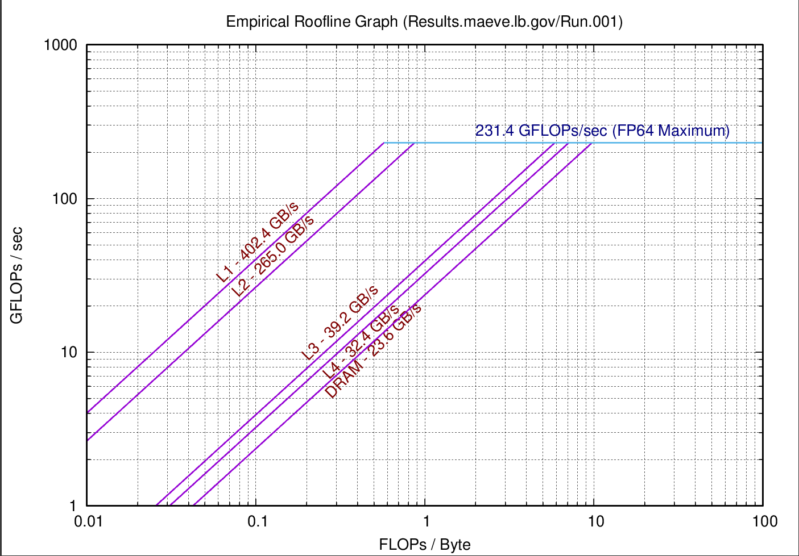
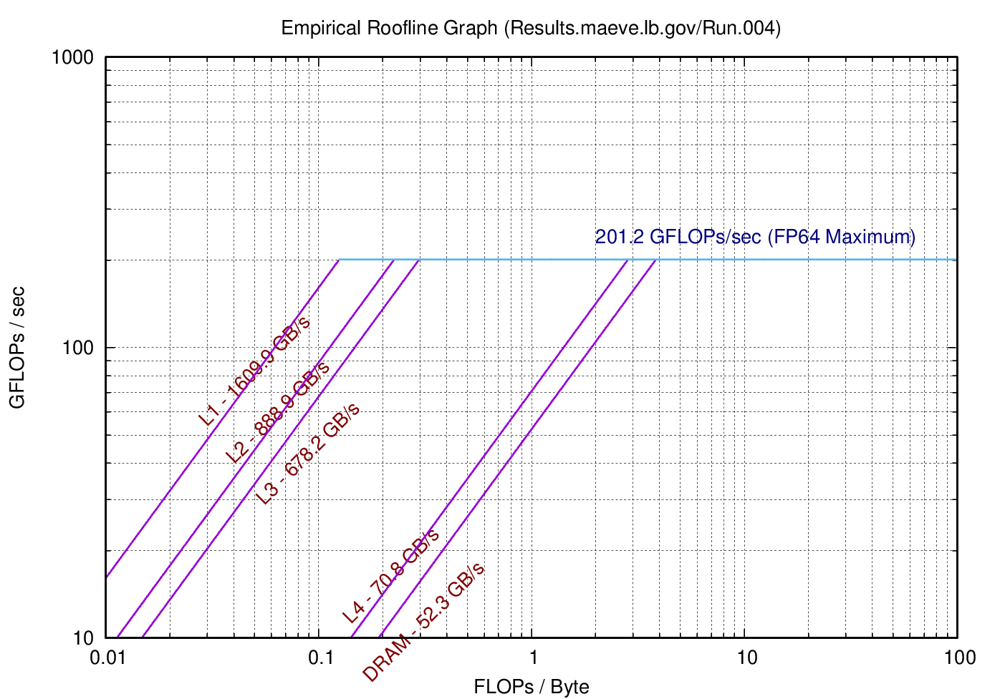
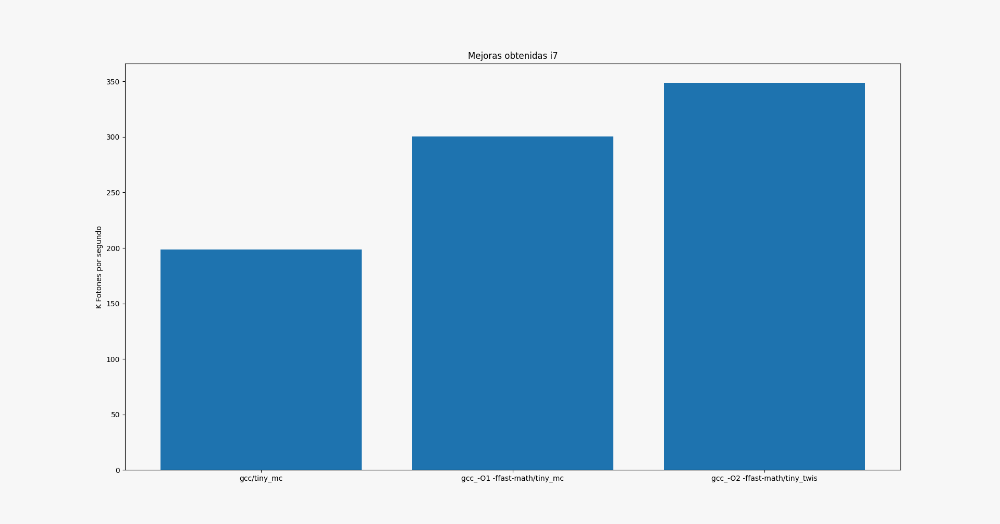
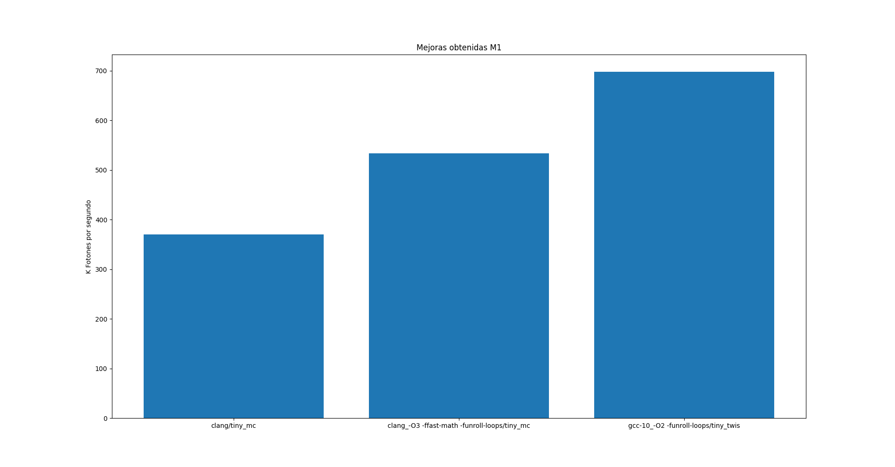

## Informe Laboratorio 1

#### Hardware y software
- Intel® Core™ i7-8550U CPU @ 1.80GHz × 8 
- 16 gb de ram 
- Ubuntu 20.04.2 LTS x86-64
- gcc 9.3.0
- clang 10.0.0-4ubuntu1
- kernel 5.8.0-48-generic 

Mediciones generadas por Empirical Roofline Toolkit para el procesador Intel® Core™ i7-8550U

---------------------------

- Apple M1 x 8 
- 16 gb ram
- gcc 10.2.1
- clang Apple clang 12.0.0
- macOS 11.2.3 ARM-64
- kernel 20.3.0

Mediciones generadas por Empirical Roofline Toolkit para el procesador Apple M1

### Metricas
Como metricas usamos la cantidad de fotones por segundo guardando los datos en el archivo results.txt
corriendo y compilando los archivos con varias combinaciones de flags y distintos compiladores.
tambien usamos Empirical Roofline Toolkit para conocer el modelo y velocidad de nuestro procesador y  capacidad, velocidad, cantidad de canales ocupados de la memoria. 

Otra opcion de metrica es usar el comando: 

    perf stat -M FLOPS ./tiny_mc

pero como solo funciona para la pc con ubuntu decidimos descartarlo en las comparaciones.

### Optimizacion 
Finalmente como optimizacion decidimos usar una libreria para generar numeros random mediante el conocido generador de numeros llamado [Mersenne twister](https://github.com/ESultanik/mtwister) ya que investigando un poco nos encontramos que el rendimiento de mersenne twister suele ser mejor que la mayoria de los generadores pseudoaleatorios. 

Esto nos brindo una gran mejora en cuanto a resultados, la implementacion de este generador esta en el archivo tiny_twis.c y lo compararemos con el tiny_mc.c.

### Mejoras a implementar en el futuro
Como mejoras a implementar en el futuro pensamos en investigar sobre otros generadores de numeros aleatorios, ya que vimos esto es lo que mas impacta en el rendimiento del programa. 
Paralelizar la generacion de numeros paralelos.

### Conclusion

