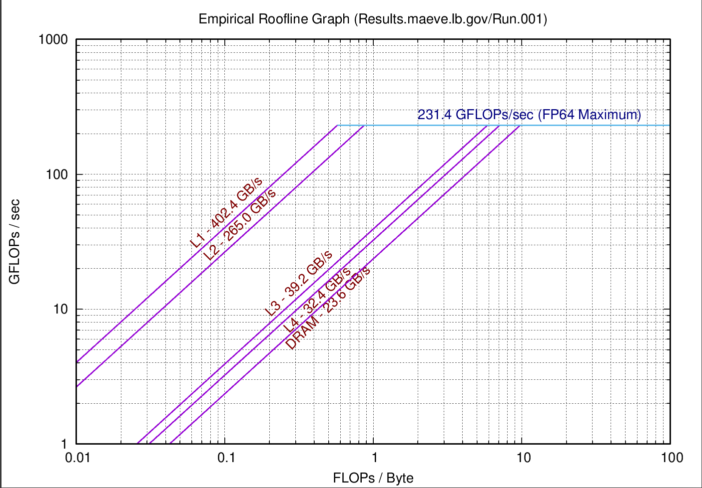
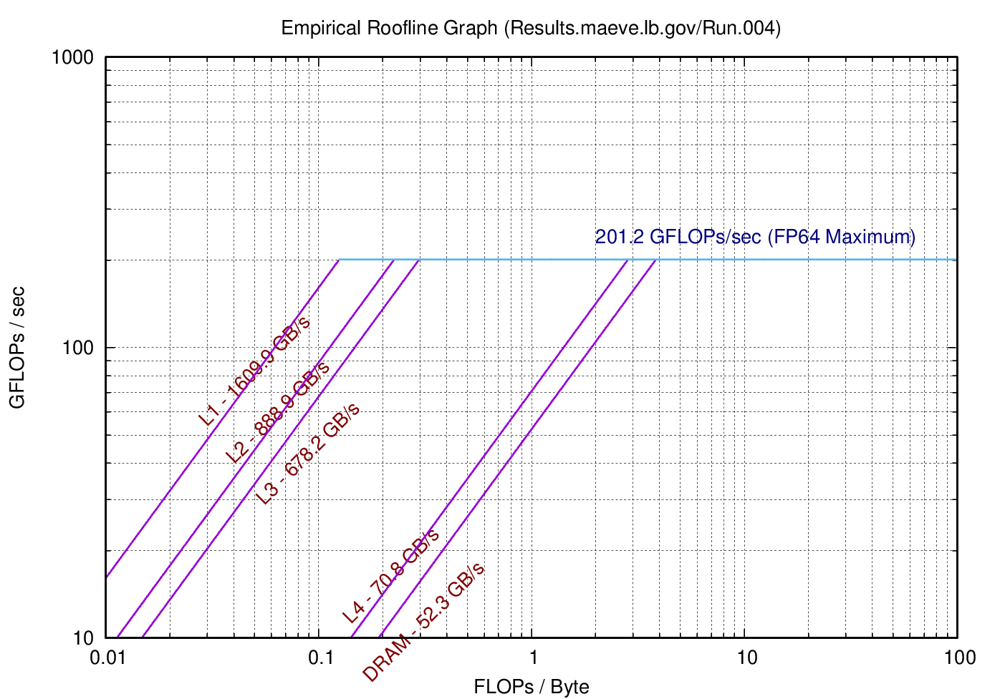
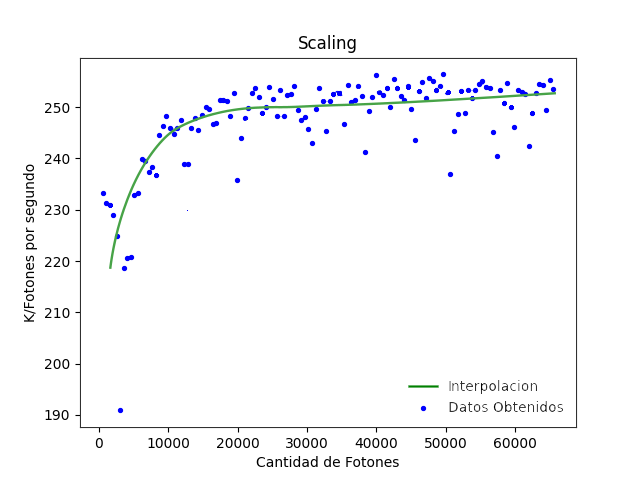
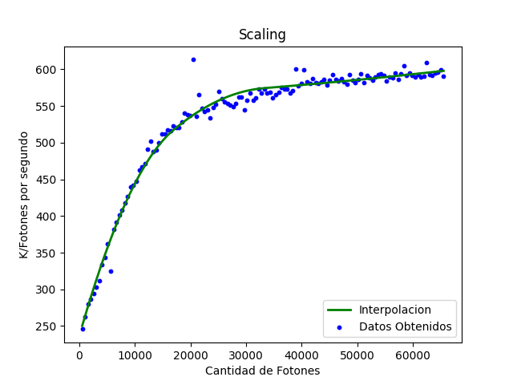
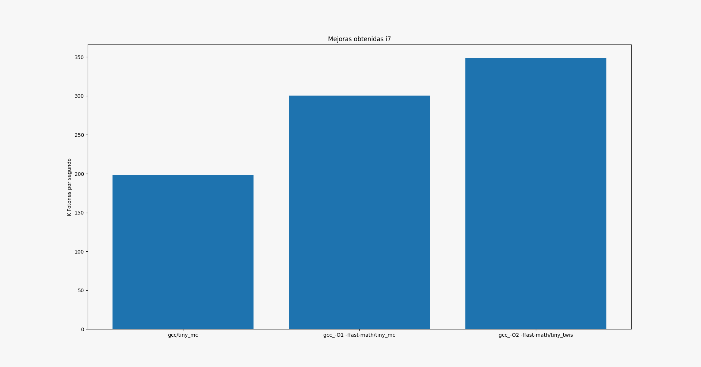
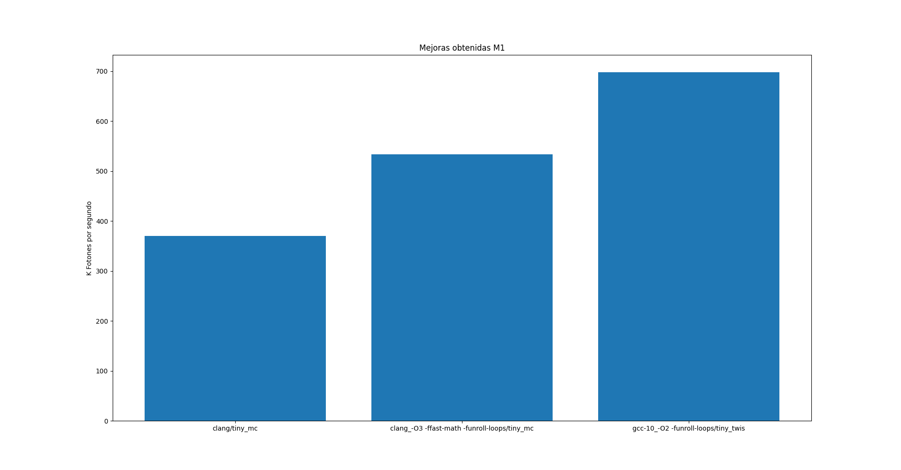

## Informe Laboratorio 1

### Integrantes: Escalera Pedro, Imán Federico.

#### Hardware y software
- Intel® Core™ i7-8550U CPU @ 1.80GHz × 8 
- 16 gb de ram DDR4 2400 MT/s 128 bit width
- Ubuntu 20.04.2 LTS x86-64
- gcc 9.3.0
- clang 10.0.0-4ubuntu1
- kernel 5.8.0-48-generic 

Mediciones generadas por Empirical Roofline Toolkit para el procesador Intel® Core™ i7-8550U

---------------------------

- Apple M1 x 8
- 16 gb ram LPDDR4x 4266 MT/s 128 bit width
- gcc 10.2.1
- clang Apple clang 12.0.0
- macOS 11.2.3 ARM-64
- kernel 20.3.0

Mediciones generadas por Empirical Roofline Toolkit para el procesador Apple M1 - Notar que se uso la misma configuracion que para el procesador intel, tomarlo con cuidado, el M1 no tiene caches L3 ni L4 y hubo flags que se desactivaron.

### Metricas
Como metricas usamos la cantidad de fotones por segundo guardando los datos en el archivo results.txt
corriendo y compilando los archivos con varias combinaciones de flags y distintos compiladores.
tambien usamos Empirical Roofline Toolkit junto a internet para conocer el modelo y velocidad de nuestro procesador y  capacidad, velocidad, cantidad de canales ocupados de la memoria. 

Otra opcion de metrica es usar el comando: 

    perf stat -M FLOPS ./tiny_mc

pero como solo funciona para la pc con ubuntu decidimos descartarlo en las comparaciones.

### Optimizacion 
Lo primero que hicimos fue armar un script en python que recorriese todo el espacio de flags que queriamos probar. El script tambien corria 10 veces el programa, descartaba el primer resultado (en general siempre daba bastante mas bajo que los subsiguientes, calienta la cache?) y sacaba la media de los resultados. Asi obtuvimos los flags que daban mejores resultados en cada computadora.

Como otra optimizacion decidimos usar una libreria para generar numeros random mediante el conocido generador de numeros llamado [Mersenne twister](https://github.com/ESultanik/mtwister) ya que investigando un poco nos encontramos que el rendimiento de mersenne twister suele ser [mejor](https://stackoverflow.com/questions/32027839/why-is-mersenne-twister-faster-than-the-linear-congruential-generator) que la mayoria de los generadores pseudoaleatorios y tiny_mc utiliza varios numeros random en cada corrida del loop principal.

Esto nos brindo una gran mejora en cuanto a resultados, la implementacion de este generador esta en el archivo tiny_twis.c y lo compararemos con el tiny_mc.c.

### Optimizaciones que no funcionaron
Algunas optimizaciones que creimos que podrian funcionar y terminamos descartando fue cambiar la llamada de sqrt en la normalizacion de vectores. Aca intentamos usar el famoso fast inverse sqrt pero tal y como aclara en el articulo de wikipedia intel tiene una instruccion mas rapida y mejor aproximada que se habilita con el flag --sse o --march=native. En el M1 tampoco notamos ninguna mejora real asi que suponemos que tambien pasa algo parecido auque las instrucciones de arm tienden a ser menos complejas asi que tal vez sea simplemente una buena implementacion de libreria.

Otra mejora que probamos fue usar el flag funroll-all-loops que fuerza el unrolling the loops cuando no se conoce cuantas iteraciones tiene el loop, creimos que esto podia ayudar a tiny_mc ya que varios de los loops no son cerrados (la cantidad de iteraciones depende exclusivamente de condiciones, no esta predeterminada en compilacion). Viendo los resultados obtuvo mas o menos el mismo resultado que --funroll-loops.

Tambien hubo optimizaciones que tenian mas efecto en una pc que en la otra, --funroll-loops en el M1 dio un muy buen resultado mientras que en Intel --ffast-math dio mejores resultados. Tambien notamos que la diferencia entre -O2 y -O3 fue trivial en ambas pc, con -O2 sacando mejores resultados en general cuando estaba en combinacion con otros flags.
### Scaling del problema
Para ver como cambiaba la velocidad dependiendo al tamaño del problema lo que hicimos fue aprovechar la posibilidad de redefinir la constante PHOTONS en compilacion con el flag -DPHOTONS para ver como afectaba el cambio de la cantidad de fotones a la perfomance, calculamos desde 512 fotones a 65534 con saltos de 512. 

Aca notamos una gran diferencia entre ambas CPUs ya que el procesador Intel a partir de 10k fotones se estabilizaba y llegaba a su performance maxima. Por otro lado en el M1 la performace crece gradualmente hasta llegar a los 30k fotones donde se empieza a estabilizar. En ambos casos el scaling es logaritmico aunque en Intel es mas constante, la cantidad de K fotones por segundo en Intel tiene un rango entre 220 y 260 descartantado puntos anomalos mientras que el M1 tiene un rango entre 250 y 600.
Tambien graficamos un spline cubico suavizado interpolando los datos para tenerlo como referencia. Estos resultados tambien se obtuvieron corriendo el programa varias veces , descartando el primer resultado y haciendo la media de los restantes. 
#### Grafico Intel Core i7

#### Grafico Apple M1

### Mejoras a implementar en el futuro
Como mejoras a implementar en el futuro pensamos en investigar sobre otros generadores de numeros aleatorios, ya que vimos esto es lo que mas impacta en el rendimiento del programa. 

Algo que estuvimos a punto de hacer pero decidimos que probablemente no era el obejtivo de este lab y de uno mas adelante era separar el programa en varios threads. Como cada foton hace su trayectoria independientemente de los otros, facilmente podemos dividir los 32k de fotones en 8 por ejemplo y lanzar 8 threads que resuelvan parte del problema. Ahi probablemente entre en juego ver que tan thread-safe es el mersenne-twister y tengamos que usar una semilla distinta para el RNG de cada thread. Esto posiblemente aumente la velocidad del programa enormemente , calculamos alredeor de x5 en Intel (4 nucleos con hyperthreading) y x6 - x7 en el M1 por los nucleos de baja performance.

### Conclusion

### Github
[Github](https://github.com/fedeiman/tiny_mc) con nuestro proyecto
