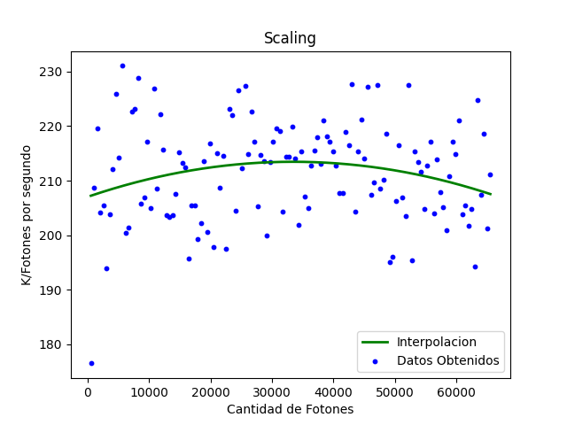
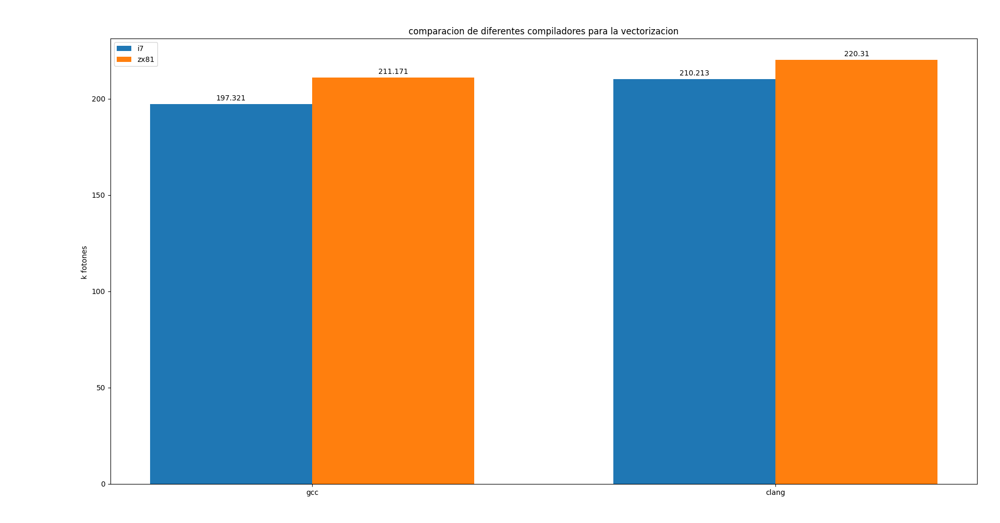
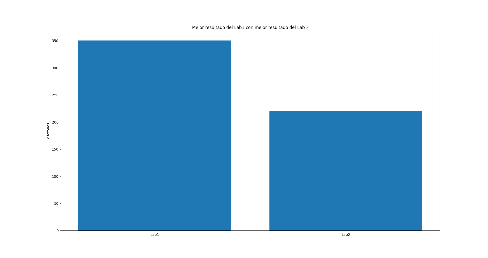

# Informe Laboratorio 2
### Integrantes: Escalera Pedro, Imán Federico.

---
## Autovectorizacion

### __GCC__:

-O3  o -ftree-vectorize activan la vectorizacion de loops pero no mostraran que optimizaron a menos que activemos otras flags como:

    -fopt-info-vec  -fopt-info-vec-optimized

El compilador mostrara que loops (por linea N°)
fueron optimizados.

    -fopt-info-vec-missed 

Detalla informacion sobre los loops que no fueron vectorizados entre otros datos.

    -fopt-info-vec-note 

Detalla informacion sobre todos los loops y las optimizaciones realizadas

    -fopt-info-vec-all

Todas las opciones anteriores juntas.

Asi con las flags  -fopt-info-vec-missed  y -fopt-info-vec-note podemos ver que absolutamente ningun loops es autovectorizado por gcc.

### __Clang__:

La vectorizacion esta habilitada por defecto en clang. 
 
Algunas de las flags mas importantes son:

    --fno-vectorize

desabilita la autovectorizacion.

    -Rpass=loop-vectorize

identifica los loops que fueron exitozamente vectorizados.

    -Rpass-missed=loop-vectorize

identifica los loops que no fueron exitozamente vectorizados.

    -Rpass-analysis=loop-vectorize

identifica porque fallo una vectorizacion 

    -Rpass-analysis=loop-vectorize-fsave-optimization-record

 enumera múltiples causas de falla de vectorización.

con clang obtenemos un poco mas de informacion de porque no esta pudiendo vectorizar ya que la flag -Rpass-analysis=loop-vectorize nos dice que la funcion rand() que genera un numero random no puede ser vectorizada y por otro lado no puede determinar el numero de loops en el do while.

### __Intentos de modificacion de codigo para autovectorizar__:

Para intentar autovectorizar decidimos intercambiar la linea

    float t = -logf(rand() / (float)RAND_MAX);

usando el polinomio de taylor para aproximar el valor del logaritmo y asi intentar poder generar algun tipo de autovectorizacion. una vez realizado esto, pudimos autovectorizar un loop, pero de todas formas el resultado obtenido era peor que sin el cambio, por lo que decidimos descartar esa solucion y comenzar con la vectorizacion manual. 

---
## Vectorizacion:
Para la vectorizacion usamos intrinsics.
Algunas de las optimizaciones que realizamos fueron:
-  Mucho uso de la funcion de multiply and add.
-  Utilizamos una version vectorizada de log que encontramos en stackoverflow y que utiliza el metodo de separar el argumento en su exponente y mantissa, tambien la editamos un poco para que use fmadd.
- Utilizamos mascaras para marcar que vectores ya habian terminado (break) y cuales debian continuar para evitar forzar al loop a terminar los 8 fotones antes de continuar al siguiente set de 8.
- Usamos la funcion de rsqrt que es mucho mas rapida y calcula:
. La utilizamos donde se calcula *(\frac{1}t)}), es claro que esto es equivalente a }{t}})  por lo que podemos hacer }}\right)) 

---
## Scaling:
Lamentablemente no notamos una gran mejoria vectorizando con intrinsics, no sabemos si esto se debe a que tuvimos que volver a srand como rng(explicado mas adelante) o a que vectorizamos todo sin analizar realmente si la vectorizacion era efectivamente mas rapida, finalmente hicimos los analisis de scaling, aunque como mencionamos obtuvimos iguales o peores resultados que sin vectorizacion. Al test de scaling lo corrimos en zx81.

---
## Problemas:
El mayor problema encontrado durante la implementacion de intrinsics fue que nos dimos cuenta que el generador mersenne twister al intentar generar 8 numeros aleatorios a la vez, generaba los mismos 8 numeros, esto causaba que en algunas corridas funcionase tiny_mc y en otras no, esto se debe al do_while donde se generan xi1 y xi2 ya que si los random son malos y son siempre iguales hay casos donde nunca sale de ahi. Creemos que este comportamiento es debido a una mala implementacion del mersenne twister ya que cuando lo miramos sin vectorizar tambien encontramos que tenia un periodo muy chico (alrededor de 150 dependiendo la corrida) antes de que se empezase a repetir. Por esto volvimos a usar srand y rand por una cuestion de que sabemos que funcionan aunque sean lentos, con eso comenzo a funcionar correctamente el codigo.

---
## Posibles mejoras:
Las posibles mejoras a futuro es buscar un buen generador de numeros que funcione bien y eficientemente. Estuvimos viendo pcg pero tuvimos problemas para implementarlo, igualmente noo encontramos ningun rng que sea particularmente bueno para generar 8 numeros aleatorios a la vez, que seria perfecto para nosotros.
Tambien nos sigue sin convencer el log del principio, buscar alguna forma mas rapida de generar una distribucion exponencial o alguna forma vectorizada estaria bueno. Encontramos [este paper](https://aip.scitation.org/doi/pdf/10.1063/1.168562) que utiliza dos randoms uniformes y algunos modulos en base 2 pero habria que hacer mediciones para ver si es mas caro hacer el log de un random o las operaciones que propone el paper que incluyen "calentar" registros y generar dos random en vez de uno.

---
## Conclusiones:

Como conclusiones generales podemos ver que no nos fue tan bien en la vectorizacion, principalmente por problemas con el generador de numeros aleatorios que usamos lo que realmente perjudica la performance del programa.
Por lo que la principal mejora a implementar a futuro es cambiar el generador por uno que funcione mas eficientemente y asi podremos obtener las mejoras esperadas en cuanto a vectorizacion.

Como vemos en este grafico, notamos que correr en zx81 no nos da mejores resultados, y que obtenemos en general un rendimiento mediocre.

Ahora podemos ver como empeoro respecto al lab 1.
Analizando ambos graficos podemos decir que la vectorizacion no es tan buena si tenemos un mal generador de numeros. ya que en el lab 1 usamos una implementacion de mersenne twister con lo que logramos una mejora sustancial en cuanto a resultados.