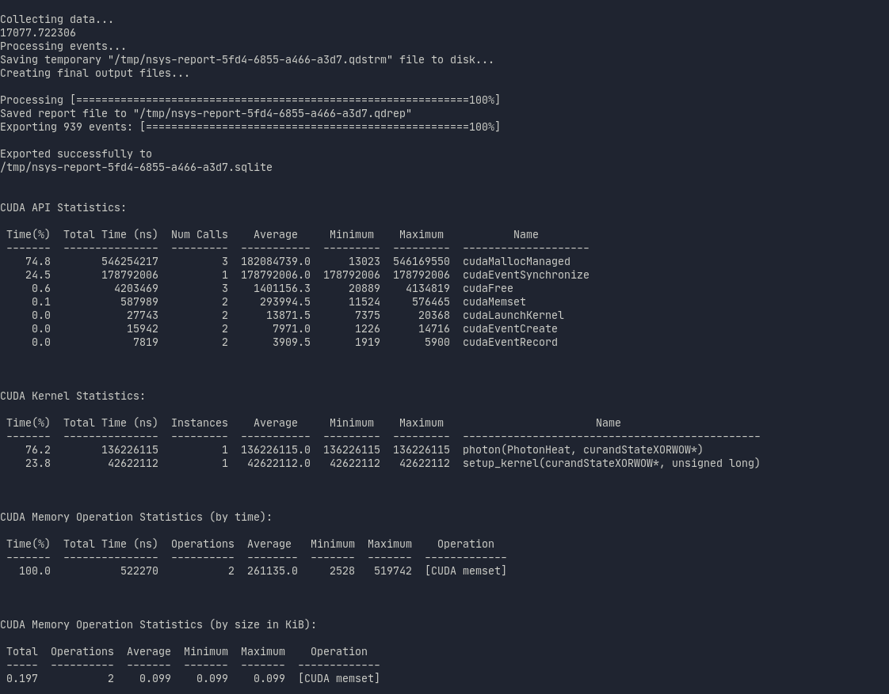
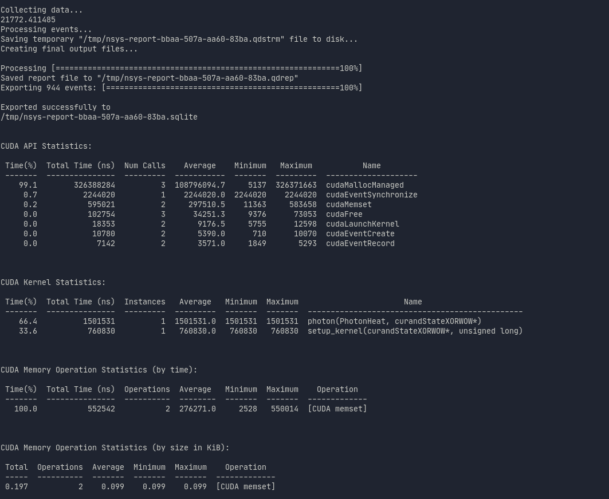
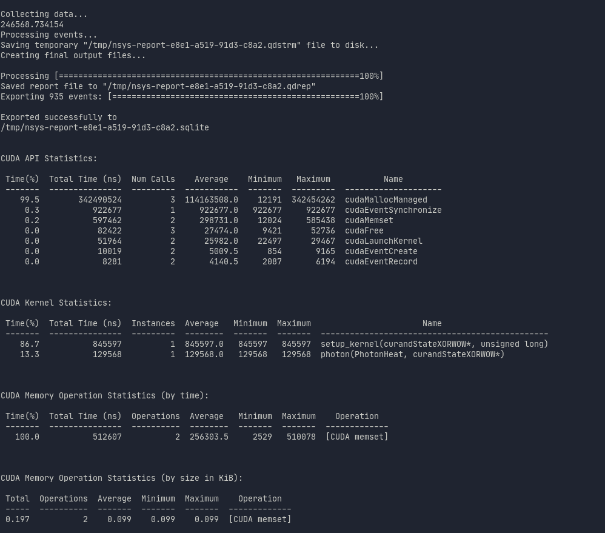
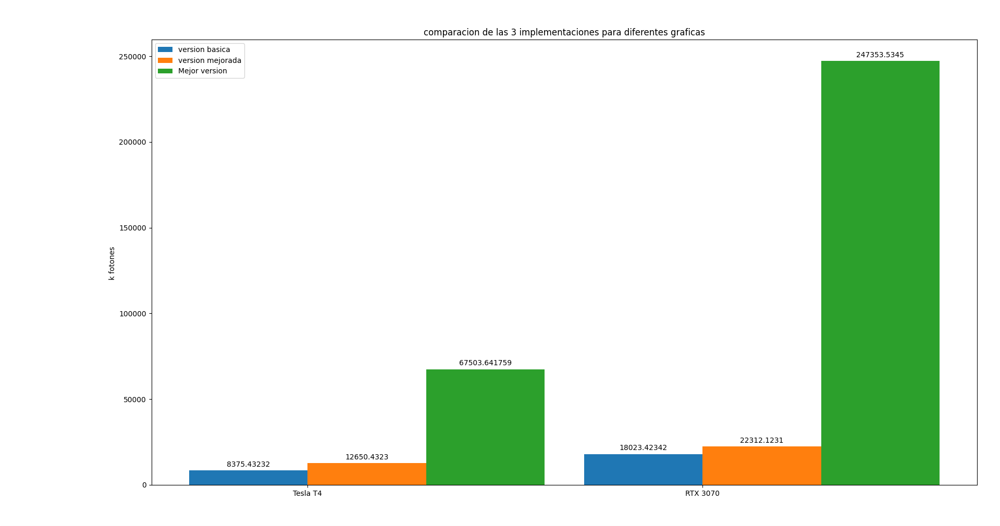
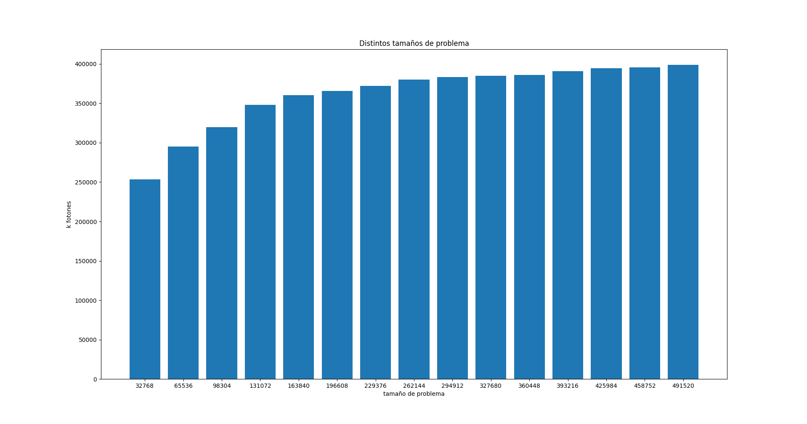
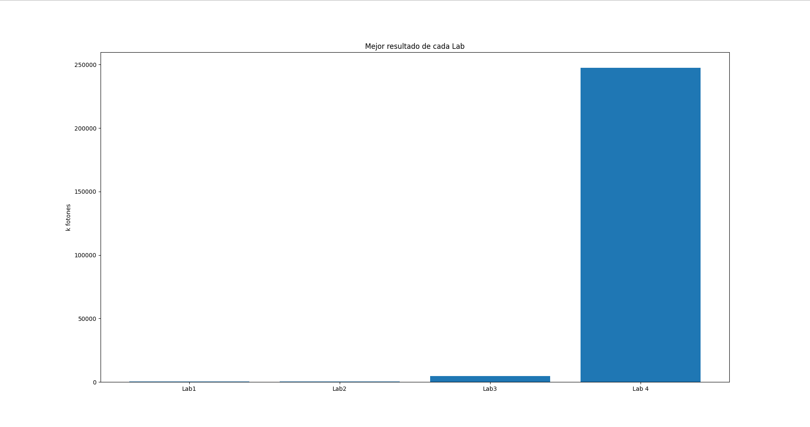

## Lab 4 CUDA

### Escalera pedro, Iman Federico.

En este laboratorio utilizaremos CUDA para poder ejecutar tiny_mc en una GPU de Nvidia, en lugar de la CPU. El mayor beneficio de hacerlo es que la GPU es mucho más rápida que la CPU cuando se trata de problemas paralelizables.

El codigo lo ejecutaremos en zx81, que cuenta con una GPU Nvidia GeForce RTX 3070.

#### Estrategias intentadas
Tomamos la primer aproximacion mas intuitiva que fue simplemente hacer arreglos en la memoria unificada y lanzar cada foton en un thread individual obtuviendo asi un rendimiento muy superior a los resultados obtenidos por cpu en los labs anteriores. Cada uno de estos threads modifica atomicamente los arreglos lo que repercute negativamente en el rendimiento.

            atomicAdd(&result.heat[shell], ((1.0f - albedo) * weight));
            atomicAdd(&result.heat2[shell], ((1.0f - albedo) * (1.0f - albedo) * weight * weight));

Para esta implementacion usamos el generador de numeros 
aleatorios de CUDA curand, ya que tiene buenas propidades estadisticas y de performance para GPGPU. Esta solucion la llamamos tiny_cuda_basico.cu 

Con esta implementacion logramos una mejora de aproximadamente 4x comparado con el mejor resultado obtenido en cpu con 23 threads.

Una mejora con respecto a la primer implementacion que realizamos fue con la ayuda del paper [CUDAMCML](https://www.atomic.physics.lu.se/fileadmin/atomfysik/Biophotonics/Software/CUDAMCML.pdf)
en la cual se explicaban varias optimizaciones para el problema de las cuales estaba una que nos parecio interesante y ayudaba con el problema de las operaciones atomicas.
Esta se basaba en un fenomeno conocido del problema de tiny_mc donde en general se suma heat al mismo shell sucesivamente, esto pasa cuando la cantidad de shells es poca (101). Lo primero que hicimos fue verificar si esto sucede, y comprobamos que si lo hace, aproximadamente en un 30 a 50% cada vez que se escribe en los arreglos de heat.
Esto nos ayuda con el problema de las operaciones atomicas ya que podemos agregar una variable que funciona a modo de cache y vaya acumulando la suma siempre que se deba aumentar calor en el mismo shell de forma sucesiva, entonces, cuando cambiamos de shell o el foton muere, en ese punto usamos atomic para escribir en memoria global.
Esto nos ahorra operaciones atomicas, lo que nos da ventajas de performance aumentando asi el rendimiento a 5.5x comparado con el mejor resultado del lab 3. esta solucion es la llamamos tiny_cuda.cu

            if(prevShell == shell){
                cachedW += (1.0f - albedo) * weight;
                cachedWS += (1.0f - albedo) * (1.0f - albedo) * weight * weight;
            }
            else{
              //drop cached value in global heat array 
              if(prevShell >= 0){
                atomicAdd(&result.heat[prevShell], cachedW);
                atomicAdd(&result.heat2[prevShell], cachedWS); 
              }
              cachedW = (1.0f - albedo) * weight;
              cachedWS = (1.0f - albedo) * (1.0f - albedo) * weight * weight;
              prevShell = shell;
            }

#### Implementacion Final:
Para la implementacion final lo que hicimos fue aramar unos arreglos de calor que eran locales a cada bloque, entonces las operaciones atomicas se reducian. Por ende cada bloque podia continuar su computo de manera independiente a cada bloque, sin ser interrumpido por las operaciones atomicas del resto de bloques.
Finalmente una vez que todos los bloques terminaban los sincronizamos, y luego haciamos la suma final en el arreglo global de forma paralela.

    static __global__ void photon(PhotonHeat globHeat, curandState *rngs)
    {
        int gtid = blockDim.x * blockIdx.x + threadIdx.x;

        __shared__ float local_heat[SHELLS];
        __shared__ float local_heat2[SHELLS];

        // The first 101 threads initialize the array in paralell 
        for (int i = threadIdx.x; i < SHELLS; i += blockDim.x){
        local_heat[i] = 0;
        local_heat2[i] = 0;
        }
        __syncthreads();

#### Posibles mejoras
Como posible mejora, pensamos usar un arreglo por thread en lugar de una por bloque lo que podria mejorar aun mas el rendimiento.                

#### Roofline

Para obtener datos de nuestro programa usamos el profiler nsys nvprof en lugar de ncu, con el siguiente comando:

    /opt/cuda/11.2.2/bin/nsys nvprof ./tiny_mc

donde podemos ver 
- Estadisticas de las llamadas a funciones de la API de CUDA, y el tiempo que toman.
- Estadisticas de llamadas a kernels y el tiempo que toman.
- Estadisticas de operaciones de memoria y el tiempo que toman.
- Estadisticas de operaciones de memoria y el tamaño de memoria en KiB usado.

con tiny_cuda_basico obtuvimos los siguiente resultados:

con tiny_cuda:

con tiny_cuda_pro:

#### Google collab
Por otra parte, usamos google collab para hacer pruebas y no ocupar asi los servidores de Famaf. 
La gpu de google que usamos era una Tesla T4.
Los resultados de esta corrida estaran incluidos en los gfaficos finales. 

#### Graficos
A continueacion mostraremos distintos graficos obtenidos.

En este grafico observamos los mejores resultados obtenidos en las 3 versiones implementadas.

En este grafico observamos como como funciona la mejor version del codigo para distintos tamaños de problema.

Finalmente una comparacion de las mejores versiones obtenidas en cada uno de los labs. (Lab 1: 731(m1 apple) Lab 2:220 Lab 3:4780 Lab 4: 247353 )

#### Conclusion
Gracias al tipo de problema presentado, es que pudimos paralelizarlo y asi obtener el mejor provecho de la GPU obteniendo un rendimiento notablemente superior que con CPU. 

Con respecto a los diferentes tamaños de problema, podemos notar como la curva se va aplanado, es decir que llega un momento en que nuestra mejor version del programa ya no mejora con respecto a problemas mas grandes, si no que se mantiene constante.

Mediante la programacion en CUDA llegamos a paralelizar el problema de la mejor manera posible y asi fue como obtuvimos resultados notables, que no se comparan con lo obtenidos con CPU.
